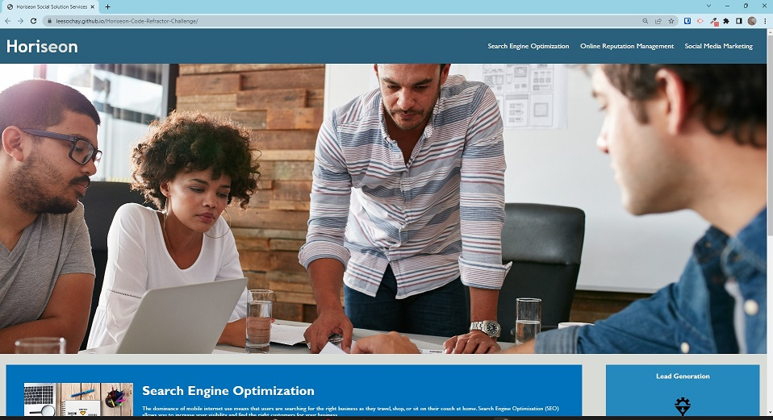
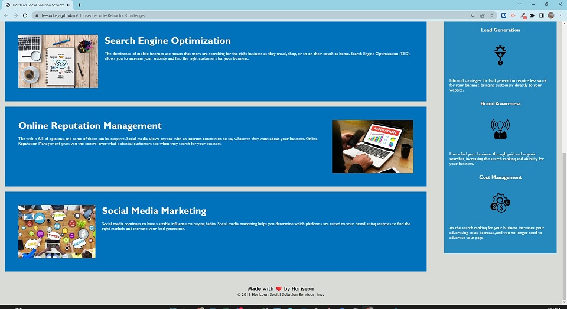

# Horiseon-Code-Refractor-Challenge

## Description

This challenge follows the On-the job ticket type of challenge. Given the starter code, the challenge was to modify the html and css to address accessibility.
The project was performed by refactoring the code, or in other words, improving the code in terms of accessibility without changing the functionality.

The Module 1 challenge description provides an important narrative for web accessibility as follows:

"Web accessibility is an increasingly important consideration for businesses. It ensures that people with disabilities can access a website using assistive technologies such as video captions, screen readers, and braille keyboards. Making a website accessible is also good for business for many reasons, one of them being that accessible sites are better positioned in search engines like Google. It also helps companies avoid litigation that can occur when people with disabilities can't access their website."

The nature of the modifications include the addition of a new descriptive title, the use of semantic html elements which give context to sections of the webpage (header, section, aside, footer) in lieu of non-semantic "div" tags, the addition of "alt text" to images, the fixing of broken link(s), the confirmation of the sequentional use of headings, the consolidation of css selectors and properties as appropriate, and the addition of comments in the html and css files.

## Usage

By modifying the code as described, the finished project is demosnstrated with the following screenshots.

Top of page

Bottom of page

The finished project page can be viewed at [Lee Sochay Horiseon Code Refractor Challenge webpage](https://www.google.com "Google's Homepage")

## Credits

Importance of web accessibility descriptive paragraph from the MSU Bootcamp Module 1 Challenge assignment page.

## License

MIT License
